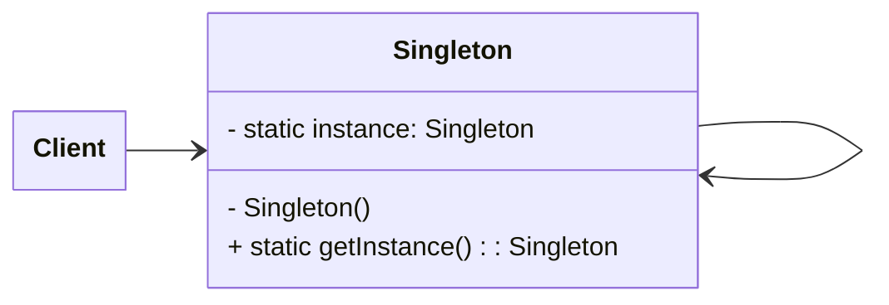

# Patrones de Diseño de Software
Análisis y Diseño de Sistemas 2

---
layout: center
---

# Agenda
- Presentación
- Actividad cuestionario

---
layout: image-left
image: ./assets/abstract-factory-en.png
---

# Definición de patrones de diseño

> Un patrón de diseño es una solución reutilizable a un problema común en el diseño de software.

- Basados en experiencias previas
- Proporcionan soluciones estructuradas
- Mejoran la mantenibilidad y escalabilidad

---
layout: image-right
image: ./assets/design_patterns_book_cover.jpg
---

# El mero mero libro
En 1994, se publica el libro: **Design Patterns: Elements of Reusable Object-Oriented Software**.
- Escrito por *"The gang of four"*
  - Erich Gamma
  - Richard Helm
  - Ralph Johnson
  - John Vlissides
- Este es EL LIBRO de patrones de diseño
  - Aunque hoy en día los ejemplos están desfasados,
  los conceptos siguen siendo aplicables
- La base los patrones de diseño viene de este libro

---

# Importancia y Aplicabilidad
## ¿Por qué usar patrones de diseño?
- Fomentan buenas prácticas de desarrollo
- Aumentan la reutilización del código
- Mejoran la comunicación entre desarrolladores
- Reducen el tiempo de desarrollo

---

# Notaciones de Patrones de Diseño

Existen diversas formas de representar patrones de diseño:
- Diagrama de clases
- Pseudocódigo

Ejemplo de diagrama UML para el patrón Singleton:

---

# Tipos de patrones de diseño
Basado en su proposito, los patrones de diseño pueden dividirse en 3 categorias principales:
- Patrones creacionales
- Patrones estructurales
- Patrones de comportamiento

---

# Patrones creacionales
Son patrones de diseño relacionados con la creación o construcción de objetos. Estos
patrones intentan controlar la forma en que los objetos son creados implementando
mecanismos que eviten la creación directa de objetos.

En el libro se definen 5 patrones creacionales:
- Singleton
- Factory
- Abstract factory
- Builder
- Prototype

<!--
Think of Creational Design Patterns as those secret Pizza recipes that Chef use. These patterns help us create objects in a smart and organized way, just like how a Chef makes a perfect Pizza every time.

Creational Design Patterns focus on the process of object creation in software development. These patterns make sure that we create things in a way that’s not only easy but also flexible, so we can change them later if we need too. They hide the complicated details of how we put pieces together.

- Factory Method Pattern: Think of it as a way to make objects with flexibility. It’s like having a blueprint for creating things. You define an interface for creating objects, but the actual creation is left to subclasses. This means different subclasses can create objects of different types using the same method.
- Abstract Factory Pattern: Imagine you’re in charge of a fancy dinner party, and you need matching tableware, cutlery and decorations. The abstract factory is like one-stop for all these related items. It provides a way to create families of objects, ensuring that everything you create fits together seamlessly.
- Singleton Pattern: This one’s all about exclusivity. It ensures that a class has just one instance, like having a VIP pass to a club. You can access that instance from anywhere, making it handy for situations where you want a single point of control or coordination in your application.
- Prototype Pattern: Instead of creating something from scratch, you make a copy of an existing one, saving time and resources. This is great when you have an object that’s similar to what you need, and you want to tweak it a bit.
- Builder Pattern: The Builder Pattern is like a set of instructions for making something complex. It helps you create that complex thing step by step, one piece at a time, without worrying too much about the details.
- Object Pool Pattern: Think of it as a resource manager for reusable items. Imagine a library that lends out books. Instead of buying a new book each time, you check one out and return it when you’re done. The object pool keeps a collection of objects, like database connections or threads, and hands them out when needed. This saves time and resources compared to createing and destroying objects frequently.
-->

---

# Patrones estructurales

Los patrones de diseño en esta categoria tienen que ver con la estructura de las clases,
con aspectos tales como composición y herencia.

En el libro se definen 7 patrones estructurales:
- Adapter
- Composite
- Proxy
- Flyweight
- Facade
- Bridge
- Decorator

<!--
A Structural Design pattern is like a recipe for putting together different objects and classes to build a bigger structure. It’s a bit like following a blueprint to construct a house. These patterns teach us how to combine the unique parts of a system in a way that’s easy to change or expand without affecting the entire system.

# Types of Structural Design Patterns

- Adapter Pattern: The Adapter Pattern allows one class to work with another class that has a different interface. It acts as a bridge between two incompatible interfaces.
- Bridge Pattern: The Bridge Pattern separates on object’s abstraction (how it behaves) from it’s implementation (how it’s done). This helps to change both independently.
- Composite Pattern: The Composite Pattern lets you the creation of hierarchical structures with various complexities while maintaining the ability to treat each element, whether simple or complex, as an individual entity.
- Decorator Pattern: The Decorator Pattern allows you to add new behaviors or responsibilities to objects without altering their existing code. It’s like adding layers of wrapping to a gift.
- Facade Pattern: The Facade Pattern provides a simplified interface to a complex system, making it easier to use.
- Flyweight Pattern: The Flyweight Patterns lets us save memory and resources by using the same kind of objects again and again. Instead of making lots of copies, it checks if we already have one, and if not, it creates a new one. This way, we don’t waste space on objects that are the same.
- Proxy Pattern: The Proxy Pattern provides a placeholder of another object to control access to it. It’s like having a remote control for a TV; you interact with the remote instead of directly with the TV.
-->

---

# Patrones de comportamiento
Este tipo de patrones proporcionan soluciones para tener mejor interacción entre objetos,
tener poco acoplamiento y flexibilidad para extender a futuro.

En el libro se definen 11 patrones de comportamiento:
- Template method
- Mediator
- Chain of responsibility
- Observer
- Strategy
- Command
- State
- Visitor
- Interpreter
- Iterator
- Memento

<!--
These patterns help solve common problems in how pieces of code share tasks, hide whay they do, and stay organized. When developers use these patterns, it’s like building a puzzle where the pieces fit together easily, making the software more organized, easy to change, and less likely to break when we need to add or change things. So it’s like having a guide to make sure all the parts of your software work together smoothly.

# Types of Behavioral Design Patterns:

- Chain of Responsibility Pattern: The Chain of Responsibility Pattern is a desing pattern in software development. It lets you pass a request through a series of objects, each having its own logic to handle the request or pass it along the chain. This pattern helps in making code more modular and flexibly, as it seprates the sender of a request from the receiver, allowing multiple objects to participate in handling requests.
- Command Pattern: The Command Pattern is a behavioral design pattern that transforms a request into an independent object called a command. This pattern encapsulate all the necessary information for an action, bundling the action and its associated parameters into a single object. It’s primary purpose is to decouple the object triggering the operation from the object performing the operation.
- Iterator Pattern: The Iterator Pattern offers a mechanism for sequentially accessing elements within a collection without revealing the internal structure of the collection.
- Mediator Pattern: The Mediator Pattern creates a middleman object that manages communication between group of objects, making them less dependent on each other.
- Memento Pattern: The Memento Pattern is like taking a snapshot of an object’s current condition and saving it in a way that you can use it to bring the object back to that exact state in the future. It’s like saving a game so you can continue from where you left off.
- Observer Pattern: The Observer Pattern establishes a relationship where one thing (called the subject) is watched by several other things (knows as observers).
- State Pattern: The State Pattern enables an object to modify how it behaves as its internal state changes.
- Strategy Pattern: The Strategy Pattern involves defining a group of different algorithm and making it possible to choose and switch between them as needed while a program is running.
- Template Method Pattern: The Template Method is like providing a recipe with some fixed steps (skeleton), but allowing different cooks (subclasses) to add their unique ingredients or flavors (override specific parts) without changing the basic cooking instructions (overall structure).
-->
---

# Ejemplos de Patrones de Diseño

<iframe width="560" height="315" src="https://www.youtube.com/embed/tAuRQs_d9F8?si=UbCR_FsAH2dxkWlp" title="YouTube video player" frameborder="0" allow="accelerometer; autoplay; clipboard-write; encrypted-media; gyroscope; picture-in-picture; web-share" referrerpolicy="strict-origin-when-cross-origin" allowfullscreen></iframe>

---
layout: image-right
image: ./assets/builder-en.png
---

# Contexto de Diseño
### ¿Cuándo aplicar patrones de diseño?
- Cuando un problema se repite en múltiples proyectos
- Cuando se requiere flexibilidad en la arquitectura
- Para mejorar la mantenibilidad y comprensión del código

---

# Principios de Diseño de Software
## Principios SOLID
Es un nemónico que consta de cinco principios de diseño que buscan hacer
de los diseños orientados a objetos más entendibles, flexibles y mantenibles.

- **S**ingle Responsibility (principio de responsabilidad única)
- **O**pen/Closed (principio abierto/cerrado)
- **L**iskov substitution (principio de substitución Liskov)
- **I**nterface segregatino (principio de segregación de interfaces)
- **D**ependency inversion (principio de inversión de dependencias)
  - OJO: **Inversión de dependencias** es el principo, **Inyección de dependencias**
  es un patrón de diseño

---
layout: center
---

<iframe width="560" height="315" src="https://www.youtube.com/embed/V3TUEeB0kW0?si=A47Lc0Hm7jPSusRD" title="YouTube video player" frameborder="0" allow="accelerometer; autoplay; clipboard-write; encrypted-media; gyroscope; picture-in-picture; web-share" referrerpolicy="strict-origin-when-cross-origin" allowfullscreen></iframe>

---
layout: end
---

# ¡Gracias por su atención!
